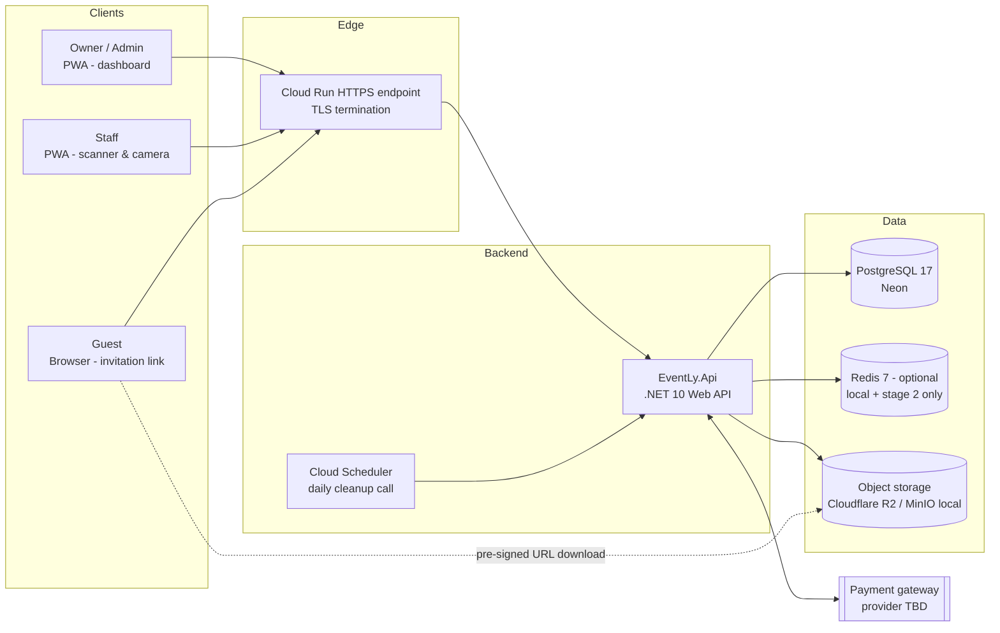
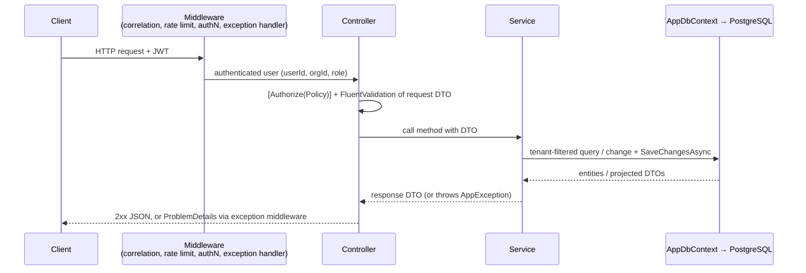
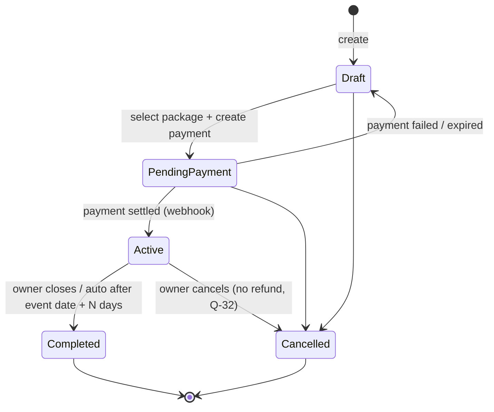
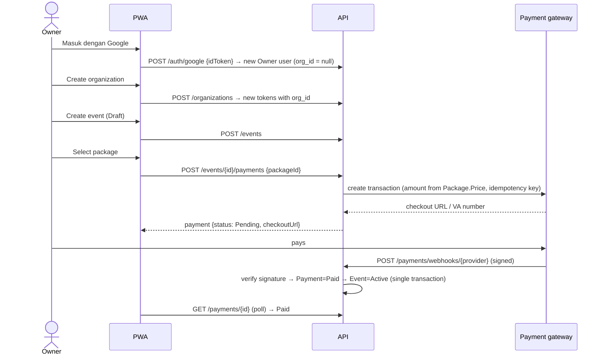
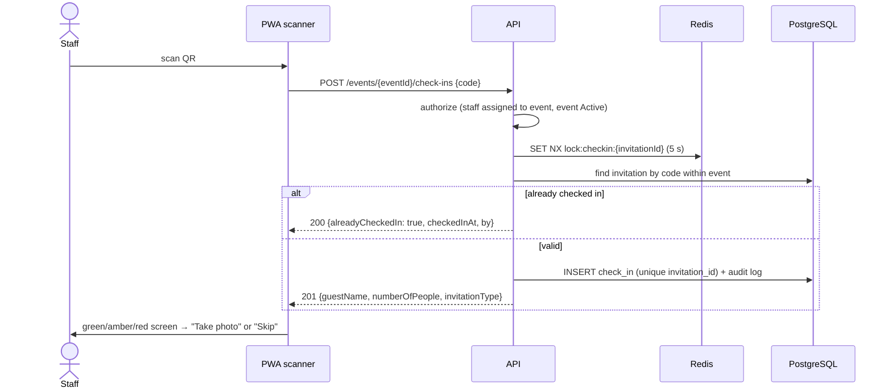

# EventLy — System Architecture Document

> Phase 0 deliverable · Status: **Draft, awaiting approval** · 2026-09-28

## 1. Purpose and scope

EventLy is a wedding-first, multi-tenant platform for managing an event from start to finish:

```
Invitation → RSVP → Guest Arrival → QR Check-in → Photo Capture → Personal Gallery → Event Report
```

This document describes how the system is built: its parts, how requests move through them, how tenants are kept apart, and how it is secured and deployed. It covers only the features in the product specification. Anything this document adds that the specification does not state is marked **[Assumption]** and listed again in [06-open-questions.md](06-open-questions.md).

## 2. Architectural drivers

| Driver | Consequence for the design |
|---|---|
| Multi-tenant SaaS (Organization is the tenant) | Shared database with an `OrganizationId` column on every tenant-owned row, EF Core global query filters, and tenant resolved from the JWT |
| Invitation is the main identity unit | QR, check-in, gallery access and photo ownership all key off `InvitationId`, never `GuestId` |
| Guests have no account | A separate *public guest* surface, authenticated by a high-entropy invitation code (bearer link) |
| Pay-per-event | Event lifecycle is gated by payment status. The payment provider is behind a port (interface) |
| Busy check-in at the venue | The check-in endpoint is fast and idempotent. Staff UI is mobile-first and camera-driven |
| Photos are private | Private bucket, short-lived pre-signed URLs issued only after authorization |
| Runnable locally with Docker | Every dependency (PostgreSQL, Redis, MinIO) runs in `docker compose` |
| PWA now, TWA later | One React codebase, installable, HTTPS-ready, with no browser-only features that TWA would break |

## 3. High-level view (C4 — containers)



**Deployment unit:** a **single ASP.NET Core Web API** (a monolith), with one process and one database. There are no microservices. Features are organised by folder inside that one project.

## 4. Backend — simple layered architecture

> **Decision (2026-09-28):** the backend uses a simple layered design, **Controller → Service → EF Core → PostgreSQL**. It does **not** use Clean Architecture, MediatR, a CQRS framework, the repository pattern by default, or microservices. EF Core's `DbContext` is used directly in services. Any extra abstraction must have a clear technical reason, and that reason is written down (see 4.5).

### 4.1 Layers

```
  HTTP
   │
┌──▼───────────────────┐
│ Controllers           │  Routing, [Authorize] policies, model binding, validation → HTTP status.
│                       │  Thin: no business logic, no DbContext.
└──┬───────────────────┘
   │ DTOs (request / response records)
┌──▼───────────────────┐
│ Services              │  Business rules, tenant checks, quotas, state transitions, audit writes.
│                       │  One service per feature (EventService, CheckInService, ...).
└──┬───────────────────┘
   │ entities
┌──▼───────────────────┐
│ EF Core (AppDbContext)│  Entity configuration, global tenant filter, interceptors, migrations.
└──┬───────────────────┘
   │
┌──▼───────────────────┐
│ PostgreSQL            │
└──────────────────────┘
```

Rules:
- Controllers call services only. Controllers never touch `AppDbContext`.
- Services use `AppDbContext` directly: LINQ queries, `AsNoTracking()` + `Select` projection straight into DTOs for reads, and `SaveChangesAsync()` for writes.
- A service may call another service when a feature needs it (for example, `CheckInService` → `AuditService`). No event bus or mediator.
- Entities are EF Core classes. They may have small helper methods for state changes (for example `Event.Activate()`) so the same rule isn't written twice. Business logic otherwise lives in services.
- Services are **concrete classes** registered in DI (`AddScoped<EventService>()`). They have no interface unless a test or an alternative implementation actually needs one.

### 4.2 Solution layout

```
backend/
  EventLy.sln
  src/
    EventLy.Api/                       ← the one application project
      Program.cs                       DI setup, middleware pipeline
      Controllers/                     AuthController, EventsController, CheckInsController, PublicInvitationsController, ...
      Services/                        AuthService, OrganizationService, EventService, PaymentService,
                                       GuestService, InvitationService, RsvpService, CheckInService,
                                       PhotoService, GalleryService, DashboardService, ReportService, AuditService
      Dtos/                            request/response records per feature (Events/CreateEventRequest.cs, ...)
      Validators/                      FluentValidation validators for request DTOs
      Entities/                        Organization, User, RefreshToken, Event, Package, Payment, Guest,
                                       Invitation, Rsvp, CheckIn, Photo, AuditLog, EventStaffAssignment, ExportJob, enums
      Data/
        AppDbContext.cs                DbSets, global tenant filter
        Configurations/                IEntityTypeConfiguration<T> per entity
        Interceptors/                  timestamps, tenant stamping
        Migrations/
        Seed/                          package catalog
      Auth/                            JwtTokenService, CurrentUser, Permissions, policy registration
      Integrations/                    external systems only (reason: swappable providers + fakes for tests)
        Storage/                       IFileStorage, S3FileStorage (S3 + MinIO), AzureBlobFileStorage
        Payments/                      IPaymentGateway, <Provider>PaymentGateway, FakePaymentGateway
      Common/
        Errors/                        AppException types (NotFound, Conflict, Forbidden, QuotaExceeded)
        Middleware/                    exception → ProblemDetails, correlation ID, security headers
        Pagination/                    PagedResult<T>, query extensions
        Options/                       strongly typed settings (JwtOptions, StorageOptions, RateLimitOptions...)
      Maintenance/                     retention cleanup + payment reconciliation, run through a protected endpoint called by Cloud Scheduler
  tests/
    EventLy.UnitTests/                 pure logic: validators, token/code generation, entity state changes, permission map
    EventLy.IntegrationTests/          services + controllers against real PostgreSQL/Redis/MinIO (WebApplicationFactory + Testcontainers)
```

Why one project and not several: nothing in the specification needs to be deployed or versioned on its own. Folders give the same separation with far less ceremony. If a second deployable (for example a separate worker) is ever needed, `Data/` and `Entities/` can be moved into a class library at that point.

### 4.3 Request flow



- **Validation:** FluentValidation validators run automatically on request DTOs (an action filter). Failures return 400 with an `errors` map.
- **Authorization:** ASP.NET Core **policy-based authorization**. Each permission (for example `checkin.perform`) is a named policy, and controllers use `[Authorize(Policy = Permissions.CheckInPerform)]`. Resource checks ("staff is assigned to this event") happen in the service.
- **Errors:** services throw typed `AppException`s (`NotFoundException`, `ConflictException("invitation.already_checked_in")`, `QuotaExceededException`...). One exception-handling middleware turns them into **RFC 7807 ProblemDetails** with a stable `code`. Unknown exceptions become 500 and are logged, with no details leaked.
- **Transactions:** a single `SaveChangesAsync()` is already atomic. For operations that span several saves or include an external call (payment webhook → mark paid → activate event → audit), the service uses `Database.BeginTransactionAsync()` explicitly.
- **Audit:** services call `AuditService.Add(...)`, which adds the row to the same `DbContext`, so the audit entry is committed together with the business change.

### 4.4 Feature map

| # | Module | Controller(s) | Service | Tables |
|---|---|---|---|---|
| 1 | Identity | `AuthController`, `UsersController` | `AuthService`, `UserService` | users, refresh_tokens |
| 2 | Organization | `OrganizationController` | `OrganizationService` | organizations |
| 3 | Event | `EventsController` | `EventService` | events, event_staff_assignments |
| 4 | Package | `PackagesController` | `PackageService` | packages |
| 5 | Payment | `PaymentsController`, `PaymentWebhooksController` | `PaymentService` | payments |
| 6 | Invitation | `InvitationsController` | `InvitationService` | invitations |
| 7 | Guest | `GuestsController` | `GuestService` | guests |
| 8 | RSVP | `RsvpsController`, `PublicInvitationsController` | `RsvpService` | rsvps |
| 9 | Check-in | `CheckInsController`, `StaffController` | `CheckInService` | check_ins |
| 10 | Photo | `PhotosController` | `PhotoService` | photos |
| 11 | Gallery | `GalleryController`, `PublicInvitationsController` | `GalleryService` | photos |
| 12 | Dashboard | `DashboardController` | `DashboardService` | (reads) |
| 13 | Reporting | `ReportsController` | `ReportService` | (reads) |
| 14 | Audit Log | `AuditLogsController` | `AuditService` | audit_logs |

### 4.5 Abstractions that *are* introduced, and why

| Abstraction | Technical reason |
|---|---|
| `IFileStorage` | The specification requires S3, Azure Blob **or** MinIO. One interface with two implementations is chosen by configuration |
| `IPaymentGateway` | The provider is still undecided (Q-1b). A `FakePaymentGateway` is needed for local development and tests, since real payments can't run in CI |
| `ICurrentUser` | One place that reads `userId` / `org_id` / `role` from the JWT. The `DbContext` tenant filter depends on it, and tests can set it |
| `TimeProvider` (built into .NET) | Tests need a controllable clock for token expiry, RSVP cut-off and retention. No custom interface is needed |

Nothing else gets an interface. In particular there are **no generic repositories**, no `IXxxService` interfaces, and no mapping library (DTOs are built with `Select` projections or small static `ToDto()` methods).

### 4.6 Key business rules and where they are enforced

| Rule | Enforced in |
|---|---|
| One Owner ↔ one Organization | `OrganizationService.Create` + unique index on `organizations.owner_user_id` |
| One invitation = one check-in | Unique index `check_ins(invitation_id)` + `CheckInService`. A repeat scan returns the existing record (idempotent) |
| One invitation = one photo session | Every photo carries `InvitationId`. A session may contain **several photos** **[Assumption — Q-6]** |
| Photos uploaded by Staff, Owner, **or the guest (own invitation, spec change 2026-09-29)** | Policy `photo.upload` for Staff/Owner. For guests, `PhotoService` checks the package's guest-upload setting and per-invitation limit (Q-25). The invitation must be **checked in** |
| Guest gallery only after check-in | `GalleryService` checks that a `CheckIn` exists for the invitation |
| Admin cannot manage payments or admins | Authorization policies (section 7.3) |
| Staff see only assigned events | `EventStaffAssignment` filter in `EventService` / `CheckInService` |
| Public invitation, check-in and upload require `Event.Status = Active` | Services check the event's status before doing anything |

**Event lifecycle [Assumption — Q-4]:**



### 4.7 Library choices

| Concern | Choice | Note |
|---|---|---|
| Runtime | .NET 10 (LTS), ASP.NET Core **controllers** | Matches the Controller → Service layering |
| ORM | EF Core 10 + Npgsql, snake_case naming convention | The primary way to access data. Raw SQL only for heavy report queries if profiling shows a need |
| Validation | FluentValidation | Runs automatically on request DTOs |
| Mapping | Manual (`Select` projection / `ToDto()`) | No AutoMapper |
| Auth | `Microsoft.AspNetCore.Authentication.JwtBearer` + policy-based authorization | |
| External login | `Google.Apis.Auth` (Google ID token validation) | Every role signs in with Google, so no password hashing library is needed |
| Cache / rate limit | StackExchange.Redis. ASP.NET Core `RateLimiter` | |
| Object storage | AWSSDK.S3 (S3 + MinIO), Azure.Storage.Blobs | Behind `IFileStorage` |
| QR | QRCoder (MIT) | |
| Excel | ClosedXML (MIT) | |
| Logging | Serilog → console (JSON) + Seq/OTLP | |
| Observability | OpenTelemetry, `/health/live`, `/health/ready` | |
| API docs | `Microsoft.AspNetCore.OpenApi` + Scalar UI | |
| Tests | xUnit, NSubstitute (only for `IFileStorage` / `IPaymentGateway`), Shouldly, Testcontainers, Bogus | |

## 5. Multi-tenancy

**Model:** shared database, shared schema, tenant discriminator column.

1. Every tenant-owned **business** entity implements `ITenantOwned { Guid OrganizationId }`: `Event`, `Guest`, `Invitation`, `Rsvp`, `CheckIn`, `Photo`, `Payment`, `EventStaffAssignment` (from Phase 4 on).
   **`User` is the deliberate exception (decided in Phase 3):** sign-in, refresh and Root must look users up across organizations, and a global filter there would make sign-in silently fail. Every user query in the organization area (`UserService`) therefore filters on the caller's organization explicitly, and the two-tenant tests cover it. `AuditLog.OrganizationId` is nullable (sign-in before onboarding) and is filtered explicitly in the audit viewer.
   **[Assumption — Q-10]** The spec's entities put `OrganizationId` only on User and Event. We **denormalize** it onto the child tables so that one global filter and one composite index protect every table. Without it, each query would have to join through `Event`, and a single missed join would leak data between tenants.
2. `ICurrentUser.OrganizationId` is read **only from the validated JWT claim `org_id`**, never from the route, query string or body.
3. `AppDbContext` applies `HasQueryFilter(e => e.OrganizationId == _currentUser.OrganizationId)` to every `ITenantOwned` entity.
4. A `SaveChanges` interceptor stamps `OrganizationId` on insert and **rejects** any update where a row's `OrganizationId` differs from the caller's.
5. **Guest (public) requests** carry no JWT. They are resolved by invitation code, from which the tenant is derived. `PublicInvitationService` looks up the invitation by code (the one allowed filter bypass), then sets the tenant for the rest of the request from that invitation.
6. `IgnoreQueryFilters()` is allowed only in a short, reviewed allow-list (login lookup by email, public invitation lookup by code, payment webhook). Code review checks it, and a test searches the source for any other use of `IgnoreQueryFilters`.
7. Cross-tenant IDs return **404, not 403**, so the API does not reveal that a resource exists.
8. **Tenant isolation integration tests** (Phase 11) seed two organizations and assert that every endpoint returns 404 for the other tenant's IDs.

## 6. Key flows

### 6.1 Onboarding and pay-per-event



- The amount is always taken **from the server-side Package**, never from the client.
- The webhook is the source of truth. It is idempotent: the provider's transaction ID is unique and duplicate calls are ignored. A reconciliation job re-checks `Pending` payments with the provider.
- The provider is chosen by configuration through `IPaymentGateway`. A `FakePaymentGateway` (with a "simulate pay" endpoint, enabled only in Development) lets the whole flow run locally.

### 6.2a Sending an invitation (decided 2026-09-29)

- **Kirim via WhatsApp:** the organizer taps the button on a guest. The PWA opens `https://wa.me/<628xxxxxxxxxx>?text=<message + invitation link>`. The phone number is normalised to international format (`08…` → `628…`). The message template is editable per event. This is free and needs no WhatsApp API. The organizer still presses Send in WhatsApp.
- **Salin link** and the **printable QR sheet** are also available.
- **No automatic bulk sending in the MVP.** It will be a separate paid add-on later, so the message template is stored per event now, ready for that.

### 6.2b Event sessions (akad, resepsi)

An event has one or more **sessions** (`event_sessions`), each with a name, date, start–end time, venue and Google Maps link. Exactly **one session is the check-in session** (the resepsi). Check-in and the guest camera window use that session's date. `events.date` and `events.venue` (from the spec) are kept in sync with the check-in session for lists and reports.

### 6.2 Invitation, RSVP and QR

- Creating an invitation generates an `InvitationCode`: **22 characters of base64url from 128 bits of CSPRNG output**. It cannot be guessed and it is the guest's credential.
- Guest URL: `https://{host}/i/{code}`.
- QR payload: the same URL. Staff scan it, and the scanner extracts the code. One QR works both as a guest's "open my invitation" link and as the check-in token.
  - *Alternative:* a separate HMAC-signed check-in token. See Q-8.
- `Invitation.QRCode` stores the **payload string**. The PNG/SVG image is rendered on demand (`GET /invitations/{id}/qr`) and cached, not stored as a blob.
- RSVP: the guest submits `Attending | NotAttending` (plus `Pending` as the initial state). It can be changed until a cut-off (event date). There is one RSVP row per invitation, updated in place.

### 6.3 Check-in (staff at the venue)



A lookup-only `GET /events/{eventId}/check-ins/lookup?code=` lets staff confirm the guest before committing the check-in.

### 6.4 Photo capture and gallery

1. Staff taps **Take photo** on the check-in result screen, or taps **Skip** (decided 2026-09-29: the photo step is optional). A photo can still be added later for any checked-in invitation, from the staff activity list. The camera opens (`<input type="file" accept="image/*" capture="environment">`, which also works in a TWA).
2. The client compresses the image (target long edge 2048 px, JPEG quality 0.85) and uploads with `multipart/form-data` to `POST /invitations/{id}/photos`.
3. The API checks the MIME type **by reading magic bytes**, the size limit and the event quota. It strips EXIF GPS data, creates a thumbnail, and stores both under
   `org/{orgId}/event/{eventId}/inv/{invitationId}/{photoId}.jpg` (+ `_thumb.jpg`).
4. `Photo.StorageUrl` stores the **object key, not a public URL**.
5. Gallery reads return **pre-signed GET URLs** with a 10-minute lifetime. The bucket is never public.
6. An Owner/Admin ZIP download is **streamed**: the API reads the photos from storage and writes the ZIP straight into the HTTP response. There is no job queue or temporary file. Galleries larger than the package limit are split per invitation.

### 6.5 Guest camera capture (spec change 2026-09-29)

Guests can capture moments at the event with the **in-app camera** on their invitation page. There is **no file upload and no picking from the phone's gallery**.

1. After check-in, the guest page shows a **"Ambil foto"** button, if the package allows it, the event hasn't turned it off, the limit isn't reached, and it is before **23:59 on the check-in session's date** (event time zone). After that the button disappears, but the gallery stays open.
2. The PWA opens a live camera view with `getUserMedia` (rear camera by default, with a switch to the front camera). The guest taps the shutter, previews the shot, then chooses **Use** or **Retake**. The browser's file picker is never shown.
3. The frame is drawn to a canvas, encoded as JPEG (long edge 2048 px, quality 0.85) and sent to `POST /public/invitations/{code}/photos`.
4. The server applies the same checks as staff uploads (magic bytes, size, re-encode, EXIF strip), plus the per-invitation guest limit and a strict rate limit. The photo is stored with `uploaded_by_type = Guest` on the same invitation.
5. The photo appears in that invitation's gallery straight away. Owner/Admin see it in the organizer gallery and can delete it.

**Honest limitation:** "camera only" is enforced by the app's interface. A technical person could still send an image to the API directly. The server limits the damage with the photo limit, rate limit, file checks, and Owner/Admin deletion. For a wedding app this is the normal trade-off.

### 6.6 Invitation extras (added to the MVP 2026-09-29)

| Feature | How it works |
|---|---|
| **Ucapan & doa** | The guest writes one message per invitation (editable). All guests of the event see the visible messages. Owner/Admin can hide or delete. Text is length-checked, stored as plain text and HTML-escaped when shown (no XSS) |
| **Amplop digital** | **Display only** (decided): bank/e-wallet accounts with a copy button, optional QRIS image and gift address. Guests transfer directly to the couple. EventLy never holds the money |
| **Musik latar** | The Owner uploads one audio file, stored privately in R2 and played from a short-lived URL. The invitation opens with a **"Buka Undangan"** cover. Tapping it starts the music, because browsers block autoplay with sound |
| **Hitung mundur** | Computed in the browser from the first session's start time. No server data |

Each feature can be switched on/off per package by Root (Q-45).

## 7. Security

### 7.1 Authentication

| Item | Design |
|---|---|
| Access token | JWT, HS256 (key from secret store; RS256 is possible later), **15 min** lifetime. Claims: `sub`, `org_id`, `role`, `email`, `jti`, `security_stamp` |
| Refresh token | Opaque random 256-bit value. **Only its SHA-256 hash is stored**. 14-day lifetime. **Rotated on every use**, and reuse detection revokes the whole token family |
| Transport to browser | Access token is kept **in memory** (JS). Refresh token goes in an **`HttpOnly; Secure; SameSite=Strict` cookie** with path `/api/auth` |
| CSRF | The refresh endpoint needs the cookie **and** a custom header (`X-Requested-With`). SameSite=Strict adds a further layer |
| **Google Sign-In — all roles (decided 2026-09-29)** | The PWA uses Google Identity Services to get a Google **ID token**. The API validates it (signature, audience = our client ID, issuer, `email_verified`) with `Google.Apis.Auth`, finds or creates the user by Google subject ID, then issues **our own** access + refresh tokens. RBAC and tenant rules stay exactly the same. Free, and works inside a TWA |
| Who may sign in | **Owner:** any verified Google account (creates a new Owner). **Admin/Staff:** only if the Google email matches a user the Owner registered (status Invited → Active on first sign-in). **Root:** only the email in `Root__Email`. A suspended user/organization is refused |
| No passwords | EventLy stores **no passwords**. The spec's "password hashing" requirement is met by not holding passwords at all; Google handles credentials, 2-step verification and account recovery |
| Guest | No JWT. The invitation code in the URL is the credential. Endpoints are read-only, apart from RSVP and guest camera capture/delete of their own photos (spec change). The invitation code is a bearer credential, so guest captures get a strict rate limit and the same file checks as staff uploads |

### 7.2 Authorization — RBAC with permissions

Roles map to **permissions** in one static table (`Permissions.cs`). Each permission is registered as an ASP.NET Core authorization policy, and controllers use `[Authorize(Policy = ...)]` rather than role names. This keeps the matrix in one place and makes it easy to test.

### 7.3 Permission matrix

| Permission | Root (platform) | Owner | Admin | Staff | Guest (code) |
|---|:-:|:-:|:-:|:-:|:-:|
| platform.packages.manage (create / edit price, limits, active) | ✅ | – | – | – | – |
| platform.owners.manage (list, suspend / reactivate) | ✅ | – | – | – | – |
| platform.events.activate_manual (payment made outside Xendit) | ✅ | – | – | – | – |
| organization.manage | – | ✅ | – | – | – |
| users.manage_admin | – | ✅ | – | – | – |
| users.manage_staff | – | ✅ | – **[Q-3]** | – | – |
| event.create / update / delete | – | ✅ | ✅ | – | – |
| event.view | – | ✅ | ✅ | assigned only | own event (public fields) |
| event.assign_staff | – | ✅ | – **[Q-3]** | – | – |
| package.view | – | ✅ | ✅ | – | – |
| payment.manage / view | – | ✅ | – | – | – |
| guest.manage | – | ✅ | ✅ | – | – |
| invitation.manage | – | ✅ | ✅ | – | – |
| rsvp.view | – | ✅ | ✅ | – | – |
| rsvp.submit | – | – | – | – | ✅ own |
| checkin.perform | – | ✅ | – **[Q-3]** | ✅ assigned | – |
| photo.upload | – | ✅ | – | ✅ assigned | – |
| gallery.view_all / photo.delete / gallery.zip | – | ✅ | ✅ | – | – |
| gallery.view_own / download_own | – | – | – | – | ✅ after check-in |
| photo.capture_own (guest, in-app camera only, spec change) | – | – | – | – | ✅ after check-in, if package allows, within limit |
| dashboard.view / report.export | – | ✅ | ✅ | – | – |
| audit.view | – | ✅ | – **[Q-3]** | – | – |

**Root** is a platform-level role (decided 2026-09-29) that belongs to no organization. It manages the package catalog and the Owner accounts that buy packages, and can manually activate an event paid outside Xendit. It can't see guests, invitations or photos inside an organization. The other columns follow the specification's role lists literally. Rows marked **[Q-3]** are places where the literal reading may not be what you intend.

### 7.4 Other controls

| Control | Implementation |
|---|---|
| Input validation | FluentValidation on every command and query. Request body size limits. Enum and length checks match DB constraints |
| Rate limiting | Named policies: `auth` (5/min per IP + email), `public-invitation` (60/min per IP), `checkin` (120/min per staff), `upload` (30/min per staff), `default` (300/min per user). Returns 429 with `Retry-After` |
| Secure file access | Private bucket. Pre-signed URLs issued only after an authorization check, short lifetime. Object keys are not guessable (GUID v7). Content is served with `Content-Disposition` |
| Upload hardening | Magic-byte check (JPEG/PNG/WebP/HEIC only), maximum 15 MB, image re-encode (removes embedded payloads), EXIF stripped |
| Transport / headers | HTTPS only (HSTS), CSP, `X-Content-Type-Options`, `Referrer-Policy: no-referrer` on guest pages (so invitation codes do not leak) |
| Secrets | Environment variables / Docker secrets, never committed. `appsettings.*.json` holds no secrets |
| Audit logging | Append-only `audit_logs`, written through `IAuditLogger` in the same transaction as the business change. Required actions: Google sign-in (success and refused), check-in, photo upload, photo delete. Also recorded: payment status change, role changes, event status change |
| PII | Guest phone numbers and emails are masked in logs. No PII in URLs apart from the opaque code |

## 8. Caching (Redis)

| Key | Content | TTL / invalidation |
|---|---|---|
| `pkg:all` | Package catalog | 1 h, evicted on seed change |
| `inv:code:{code}` | Invitation → eventId, orgId, status (public page lookup) | 10 min, evicted on invitation change |
| `evt:public:{eventId}` | Public event details for the invitation page | 10 min, evicted on event update |
| `dash:{eventId}` | Dashboard counters | 30 s, evicted by check-in, RSVP and photo events |
| `lock:checkin:{invitationId}` | Distributed lock | 5 s |
| `idem:{key}` | Idempotency-Key responses for POSTs (payment create, photo upload) | 24 h |
| rate-limit counters | Sliding window | per policy |

PostgreSQL is the source of truth. **Redis is optional** (`Cache:Provider = Memory | Redis`). The free stage-1 production setup uses the in-memory provider (single instance). Locally, docker compose still includes Redis, so the Redis path stays tested. Without Redis the check-in lock is skipped: the unique index on `check_ins.invitation_id` alone guarantees one check-in.

## 9. Frontend architecture (summary)

This is covered fully in [04-frontend-structure.md](04-frontend-structure.md).

```
React (routes / layouts)
   │
Feature modules (auth, organization, events, payments, guests, invitations, rsvp, checkin, photos, gallery, dashboard, reports, audit)
   │
API client (typed, generated from OpenAPI, fetch wrapper with token refresh)
   │
State management (TanStack Query = server state · Zustand = session/UI state)
```

## 10. Deployment topology

### Local (Phase 1 onward, as built)

```
docker compose up --build            (compose.yaml)
 ├── postgres   PostgreSQL 17, volume pgdata
 ├── redis      Redis 7 (append-only), volume redisdata — keeps the Redis code path tested
 ├── migrate    the app image run as `dotnet EventLy.Api.dll migrate`: applies migrations, then exits
 └── app        the same image: API + built PWA on http://localhost:8080 (starts after migrate succeeds)
```

- **One image** (root `Dockerfile`) holds the API and the built PWA, so local and Cloud Run run the same thing.
- **Migrations** use the `migrate` argument of the same image, not a separate EF migration bundle. This is one less build artefact, and the same command becomes the Cloud Run migration job. The API never migrates when it starts.
- **Object storage for local development** is added in Phase 9. MinIO's community Docker images changed status in 2025, so the local S3-compatible emulator is chosen then. Production uses Cloudflare R2.

### Production — free-tier setup (stage 1, decided 2026-09-29)

Goal: **Rp 0 per month** while traffic is small, and **one-command deployment**. Region: **Jakarta (`asia-southeast2`)** for the app.

```
                ┌─────────────────────────────────────────────────┐
Browser/PWA ───►│ Cloud Run "evently" (asia-southeast2, Jakarta)  │  free tier; min instances 0, max 1
                │  .NET 10 API  +  built PWA served from wwwroot  │  one service, one domain, one deploy
                └───────┬───────────────────────────┬─────────────┘
                        │ SQL (TLS)                 │ S3 API
                ┌───────▼────────┐          ┌───────▼──────────────┐
                │ Neon PostgreSQL│          │ Cloudflare R2 bucket │  10 GB free, zero egress
                │ (Singapore)    │          │ (private)            │  guests download photos
                │ free: 0.5 GB   │          └──────────────────────┘  via pre-signed URL directly
                └────────────────┘
Secrets: Cloud Run environment variables from Secret Manager (free tier)
Scheduled cleanup: Cloud Scheduler (free: 3 jobs) → internal endpoint
```

| Piece | Choice | Why |
|---|---|---|
| App hosting | **Cloud Run**, Jakarta. The API also serves the built PWA files (frontend and API on one domain) | Free tier (2M requests, 180k vCPU-s, 360k GiB-s per month). Jakarta is a "Tier 2" region, so the free allowance stretches a little less far than in the US. It is still ample for testing and small events. One service is the easiest to deploy |
| Database | **Neon** PostgreSQL free plan, Singapore region | Cloud SQL has **no free tier** (it is paid from day one). Neon is free, with 0.5 GB storage and 100 compute-hours per month, and scales to zero when idle |
| Photo storage | **Cloudflare R2** | The Google Cloud Storage free tier only exists in US regions. R2 gives 10 GB free, **with no charge for downloads**, and is S3-compatible, so the existing `S3FileStorage` works unchanged. **No extra GCS adapter is needed** |
| Cache / rate limit | **No Redis at this stage.** Uses the ASP.NET Core in-memory cache and in-memory rate limiter | Memorystore has no free tier. With a maximum of 1 Cloud Run instance, in-memory is correct and simpler. Switching to Redis later is a configuration change (`IDistributedCache`). Double check-ins are already prevented by the database unique index |
| Deploy | `gcloud run deploy evently --source . --region asia-southeast2` | One command. Google builds the Dockerfile in the cloud (Cloud Build) and deploys it. Code lives on GitHub. GitHub Actions runs build and tests. Automatic deploy on push can be added later |
| Migrations | The same image run with the argument `migrate`, as a one-off Cloud Run Job before the new version goes live | The API never migrates itself when it starts |
| Background work | **No always-on background workers.** The gallery ZIP is streamed directly in the download request. Retention cleanup is a daily Cloud Scheduler call to a protected endpoint | On the free setup, Cloud Run only gives CPU while a request is running |
| Logs / monitoring | Serilog JSON → Cloud Logging (free allowance). Uptime check + budget alert | |

**Honest caveats of the free setup**
- Google Cloud needs a **billing account (credit card)** even to use the free tier. New accounts also get a free trial credit. We set a **budget alert** and `max-instances=1` so usage can never grow unexpectedly.
- **Cold start:** after a quiet period, the first request can take about 2–5 seconds while Cloud Run starts and Neon wakes up. On event day it is worth opening the app a few minutes before guests arrive. Keeping 1 instance always on removes this, but costs money.
- Traffic from Jakarta to Neon (Singapore) counts as outbound traffic. For small usage it is normally covered or costs a few cents. Downloading large ZIP galleries also goes through Cloud Run. The budget alert catches any cost.
- Neon deletes free projects that are **inactive for 90 days**. The backup script below covers this.
- **Backups:** a scheduled `pg_dump` stored in R2, plus Neon's built-in restore window. A monthly restore test is documented in the runbook.

**Stage 2 (when there is a budget):** Cloud SQL Jakarta, Memorystore Redis, min instances 1, a separate frontend CDN. Only configuration changes, not code.

## 11. Non-functional targets [Assumption — Q-14]

| Metric | Target |
|---|---|
| Check-in API p95 | < 300 ms |
| Public invitation page p95 (API) | < 200 ms (cached) |
| Photo upload (3 MB) end-to-end | < 3 s on 4G |
| Guests per event (Enterprise) | 5,000 |
| Concurrent staff scanners per event | 20 |
| Availability | 99.5 % monthly |

## 12. Explicitly out of scope

These are not in the specification and will **not** be built: guest accounts, photo approval workflow, automatic bulk email/WhatsApp sending (a future paid add-on), seat/table management, automatic reminders, per-organization branding, multiple organizations per owner, a platform console beyond the Root package/Owner pages, native Android app (TWA only, later), and offline check-in (see Q-9).
