# EventLy — Database ERD

> Phase 0 deliverable · Status: **Draft, awaiting approval** · PostgreSQL 17 · EF Core 10 code-first

## 1. Conventions

| Convention | Rule |
|---|---|
| Naming | `snake_case` tables (plural) and columns |
| Primary keys | `uuid`, generated in the app as **UUID v7** (`Guid.CreateVersion7()`), which sorts by time and is index-friendly |
| Timestamps | `timestamptz`, stored in UTC. Every table has `created_at` and `updated_at`, set by an EF interceptor |
| Enums | Stored as `text` with a `CHECK` constraint. This is readable, safe to migrate and easy to report on |
| Tenant column | `organization_id` on every tenant-owned table, part of the leading index columns |
| Soft delete | Only on `events` and `guests` (`deleted_at`). Photos are **hard-deleted**: the row and the object are removed, since deleting is the Owner's explicit intent |
| Concurrency | `xmin` system column mapped as the EF concurrency token |
| Money | `numeric(14,2)` + `currency char(3)` |

Columns in the product specification's entity list are shown plain. Columns and tables **added** by this design are tagged `+` below, and each addition has a reason.

## 2. Entity-relationship diagram

```mermaid
erDiagram
    ORGANIZATIONS ||--o{ USERS : "has"
    ORGANIZATIONS ||--o{ EVENTS : "owns"
    USERS ||--o{ REFRESH_TOKENS : "has"
    PACKAGES ||--o{ EVENTS : "selected by"
    EVENTS ||--o{ PAYMENTS : "paid by"
    EVENTS ||--o{ EVENT_STAFF_ASSIGNMENTS : "staffed by"
    USERS ||--o{ EVENT_STAFF_ASSIGNMENTS : "assigned"
    EVENTS ||--o{ GUESTS : "invites"
    EVENTS ||--|{ EVENT_SESSIONS : "has"
    GUESTS }o--o{ EVENT_SESSIONS : "invited to (guest_sessions)"
    GUESTS ||--|| INVITATIONS : "receives"
    EVENTS ||--o{ INVITATIONS : "issues"
    INVITATIONS ||--o| RSVPS : "answered by"
    INVITATIONS ||--o| CHECK_INS : "checked in once"
    USERS ||--o{ CHECK_INS : "performed by (staff)"
    INVITATIONS ||--o{ PHOTOS : "owns"
    INVITATIONS ||--o| WISHES : "writes"
    EVENTS ||--o{ GIFT_ACCOUNTS : "shows"
    INVITATIONS ||--o{ GIFT_CONFIRMATIONS : "confirms (optional, Q-41)"
    EVENTS ||--o{ PHOTOS : "contains"
    USERS ||--o{ PHOTOS : "uploaded by"
    USERS ||--o{ AUDIT_LOGS : "acts"
    ORGANIZATIONS ||--o{ AUDIT_LOGS : "scopes"

    ORGANIZATIONS {
        uuid id PK
        text name
        text status "Active|Suspended"
        uuid owner_user_id UK "+ enforces 1 owner : 1 org"
        timestamptz created_at
    }
    USERS {
        uuid id PK
        uuid organization_id FK "nullable until org created"
        text name
        citext email UK
        text google_subject UK "+ Google account ID, set on first sign-in"
        text avatar_url "+ from Google profile"
        text terms_version "+ accepted Terms/Privacy version (Owner)"
        timestamptz terms_accepted_at "+"
        text role "Root|Owner|Admin|Staff (Root: organization_id null)"
        text status "+ Invited|Active|Disabled"
        uuid security_stamp "+ invalidates tokens"
    }
    REFRESH_TOKENS {
        uuid id PK "+ table"
        uuid user_id FK
        text token_hash UK
        uuid family_id
        timestamptz expires_at
        timestamptz revoked_at
        uuid replaced_by_id
    }
    EVENT_SESSIONS {
        uuid id PK "+ table (akad, resepsi)"
        uuid organization_id FK
        uuid event_id FK
        text name "e.g. Akad Nikah, Resepsi"
        timestamptz starts_at
        timestamptz ends_at
        text venue
        text maps_url
        bool is_check_in_session "exactly one per event"
        int sort_order
    }
    WISHES {
        uuid id PK "+ table (ucapan & doa)"
        uuid organization_id FK
        uuid event_id FK
        uuid invitation_id FK "UK - one per invitation"
        text message "max 500"
        bool is_hidden "Owner/Admin moderation"
        timestamptz created_at
        timestamptz updated_at
    }
    GIFT_ACCOUNTS {
        uuid id PK "+ table (amplop digital, display only)"
        uuid organization_id FK
        uuid event_id FK
        text kind "Bank|EWallet"
        text provider "e.g. BSI, BCA, GoPay"
        text account_number
        text account_holder
        int sort_order
    }
    GIFT_CONFIRMATIONS {
        uuid id PK "+ table (optional, Q-41)"
        uuid organization_id FK
        uuid event_id FK
        uuid invitation_id FK
        text sender_name
        numeric amount "nullable"
        text note
        timestamptz created_at
    }
    PACKAGES {
        uuid id PK
        text code UK "+ BASIC|PREMIUM|ENTERPRISE"
        text name
        numeric price
        char currency "+"
        jsonb feature "limits and flags"
        bool is_active "+"
    }
    EVENTS {
        uuid id PK
        uuid organization_id FK
        text name
        text category "Wedding|Corporate|Birthday|Community|Other"
        timestamptz date "= check-in session (kept in sync)"
        text venue "= check-in session (kept in sync)"
        text description "+ couple names + greeting"
        text cover_image_key "+ optional, in R2"
        text whatsapp_template "+ message for Kirim via WhatsApp"
        text music_key "+ background music file in R2 (Q-43)"
        text gift_qris_key "+ optional QRIS image (Q-41)"
        text gift_address "+ optional gift delivery address"
        text time_zone "+ IANA, default Asia/Jakarta"
        bool guest_upload_enabled "+ Owner/Admin can turn it off (Q-25)"
        uuid package_id FK "nullable while Draft"
        jsonb package_snapshot "+ name, price, limits frozen at payment"
        text status "Draft|PendingPayment|Active|Completed|Cancelled"
        timestamptz activated_at "+"
        timestamptz deleted_at "+"
    }
    PAYMENTS {
        uuid id PK
        uuid organization_id FK "+"
        uuid event_id FK
        uuid package_id FK "+ price snapshot source"
        jsonb package_snapshot "+ package at checkout, copied to the event when paid"
        numeric amount
        char currency "+"
        text status "Pending|Paid|Failed|Expired|Cancelled"
        timestamptz payment_date
        text provider "+ Xendit|Fake|Manual"
        text provider_reference UK "+ idempotent webhook"
        text checkout_url "+"
        timestamptz expires_at "+"
        uuid confirmed_by "+ Root user, for Manual payments"
        text note "+ e.g. bank transfer reference"
        xid xmin "+ concurrency token (two webhooks can't both settle)"
    }
    EVENT_STAFF_ASSIGNMENTS {
        uuid id PK "+ table"
        uuid organization_id FK
        uuid event_id FK
        uuid user_id FK
    }
    GUESTS {
        uuid id PK
        uuid organization_id FK "+"
        uuid event_id FK
        text name
        text phone
        citext email
        text guest_type "Individual|Group (+ VIP/Family? Q-5)"
        int number_of_people
        timestamptz deleted_at "+"
    }
    INVITATIONS {
        uuid id PK
        uuid organization_id FK "+"
        uuid event_id FK
        uuid guest_id FK "UK - 1 invitation per guest"
        text code UK "128-bit base64url"
        text qr_code "QR payload (URL)"
        text type "Individual|Group"
        text status "Active|Revoked"
        timestamptz opened_at "+ first view"
    }
    RSVPS {
        uuid id PK
        uuid organization_id FK "+"
        uuid invitation_id FK "UK"
        text status "Pending|Attending|NotAttending"
        timestamptz responded_at
    }
    CHECK_INS {
        uuid id PK
        uuid organization_id FK "+"
        uuid event_id FK "+ fast per-event stats"
        uuid invitation_id FK "UK - one check-in"
        uuid staff_id FK
        timestamptz check_in_time
    }
    PHOTOS {
        uuid id PK
        uuid organization_id FK "+"
        uuid event_id FK
        uuid invitation_id FK
        uuid uploaded_by FK "nullable - null when uploaded by the guest"
        text uploaded_by_type "+ Staff|Owner|Guest"
        text storage_url "object key, not public URL"
        text thumbnail_key "+"
        text content_type "+"
        bigint size_bytes "+"
        timestamptz created_at
    }
    AUDIT_LOGS {
        uuid id PK
        uuid organization_id FK "+ nullable (pre-org login)"
        uuid user_id FK "nullable (guest / failed login)"
        text action "e.g. auth.login, checkin.create"
        timestamptz timestamp
        text entity_type "+"
        uuid entity_id "+"
        jsonb metadata "+"
        inet ip_address "+"
        text user_agent "+"
        text correlation_id "+"
    }
```



## 3. Justification of additions

| Addition | Why it is needed |
|---|---|
| `organizations.owner_user_id` (unique) | Enforces the "one Owner has one Organization" rule in the database itself |
| `users.status`, `security_stamp` | Invited → Active on first Google sign-in, disabling staff, invalidating tokens on role change or suspension |
| `refresh_tokens` | Phase 2 requires refresh tokens. Only hashes are stored, with rotation and family revocation |
| `packages.code`, `currency`, `is_active` | Stable identifier for seeding and code checks. Currency is needed for payment |
| `events.time_zone` | The guest camera closes at 23:59 on the event date in the event's own time zone (WIB/WITA/WIT) |
| `events.activated_at` | Records when payment activated the event |
| `events.package_snapshot` | Root can edit packages from the UI at any time. The snapshot keeps an already-paid event on the price and limits it paid for **[Q-20]** |
| `payments.package_id`, `currency`, `provider`, `provider_reference`, `checkout_url`, `expires_at` | A real payment integration needs these. `provider_reference` being unique makes webhooks idempotent |
| `payments.package_snapshot` | The package at checkout. If Root edits the package before the webhook arrives, the event still gets what the Owner was charged for |
| `payments.confirmed_by`, `note`, provider `Manual` | Root can activate an event paid outside Xendit. It is still recorded as a payment, so reports and history stay complete |
| `event_sessions` (+ `guest_sessions` link) | Akad + resepsi decision: several sessions per event, one of them is the check-in session. `guest_sessions` records which sessions each guest is invited to (Q-38) |
| `users.google_subject`, `avatar_url`; **no `password_hash`** | Every role signs in with Google (decided 2026-09-29), so the spec's `PasswordHash` column is dropped. EventLy holds no passwords |
| `events.description`, `cover_image_key`, `whatsapp_template` | Invitation page content and the WhatsApp message |
| `wishes`, `gift_accounts`, `gift_confirmations`, `events.music_key` / `gift_qris_key` / `gift_address` | Features added to the MVP on 2026-09-29 (ucapan & doa, amplop digital, musik latar). The countdown needs no data |
| `event_staff_assignments` | The spec says Staff "view **assigned** events". This needs a link table between events and staff users |
| `organization_id` on child tables | Single-column tenant filter and index. Stops tenant data leaking through a missed join. See architecture §5 |
| `check_ins.event_id` | Per-event check-in stats without a join |
| `invitations.opened_at` | Invitation statistics ("opened vs not opened") for the dashboard. **Optional** — drop it if you don't want it (Q-13) |
| `photos.uploaded_by_type` | Guests can take photos with the in-app camera (spec change 2026-09-29) but have no user account, so `uploaded_by` is null for them. This column says who uploaded the photo |
| `photos.thumbnail_key`, `content_type`, `size_bytes` | Gallery performance and storage quota per package |
| `audit_logs.organization_id`, `entity_*`, `metadata`, `ip_address`, `user_agent`, `correlation_id` | Tenant-scoped audit viewing and forensic value. The spec's 4 columns alone can't answer "who checked in *which* guest" |

## 4. Indexes and constraints

```sql
-- identity / tenancy
CREATE UNIQUE INDEX ux_users_email              ON users (email);
CREATE UNIQUE INDEX ux_organizations_owner      ON organizations (owner_user_id);
CREATE INDEX        ix_users_org_role           ON users (organization_id, role);
CREATE UNIQUE INDEX ux_refresh_tokens_hash      ON refresh_tokens (token_hash);

-- events
CREATE INDEX        ix_events_org_date          ON events (organization_id, date DESC) WHERE deleted_at IS NULL;
-- one check-in session per event: enforced by the validator (a partial unique index can't be deferred)
CREATE UNIQUE INDEX ux_users_google          ON users (google_subject) WHERE google_subject IS NOT NULL;
CREATE UNIQUE INDEX ux_staff_assignment         ON event_staff_assignments (event_id, user_id);
CREATE INDEX        ix_staff_assignment_user    ON event_staff_assignments (user_id);

-- payments
CREATE UNIQUE INDEX ux_payments_provider_ref    ON payments (provider, provider_reference);
CREATE UNIQUE INDEX ux_payments_one_paid        ON payments (event_id) WHERE status = 'Paid';
CREATE INDEX        ix_payments_pending         ON payments (status, expires_at) WHERE status = 'Pending';

-- guests / invitations
CREATE INDEX        ix_guests_event_name        ON guests (event_id, name) WHERE deleted_at IS NULL;
CREATE UNIQUE INDEX ux_invitations_code         ON invitations (code);
CREATE UNIQUE INDEX ux_invitations_guest        ON invitations (guest_id);
CREATE INDEX        ix_invitations_event_status ON invitations (event_id, status);

-- rsvp / check-in / photos
CREATE UNIQUE INDEX ux_rsvps_invitation         ON rsvps (invitation_id);
CREATE UNIQUE INDEX ux_check_ins_invitation     ON check_ins (invitation_id);   -- one invitation = one check-in
CREATE INDEX        ix_check_ins_event_time     ON check_ins (event_id, check_in_time);
CREATE INDEX        ix_photos_invitation        ON photos (invitation_id, created_at);
CREATE INDEX        ix_photos_event             ON photos (event_id, created_at);

-- audit
CREATE INDEX        ix_audit_org_time           ON audit_logs (organization_id, "timestamp" DESC);
CREATE INDEX        ix_audit_entity             ON audit_logs (entity_type, entity_id);

-- checks (examples)
ALTER TABLE guests ADD CONSTRAINT ck_guests_people CHECK (number_of_people BETWEEN 1 AND 50);
ALTER TABLE rsvps  ADD CONSTRAINT ck_rsvps_status  CHECK (status IN ('Pending','Attending','NotAttending'));
```

Rules that span tables are enforced in the services, not in SQL. For example, an `Individual` invitation must have `number_of_people = 1`.

**Audit log immutability:** the application's database role has **`INSERT` and `SELECT` only** on `audit_logs`. No `UPDATE` or `DELETE` is granted. Retention is handled by a separate maintenance role.

## 5. Package seed (initial values, editable by Root)

```json
{
  "maxGuests": 150,
  "maxPhotos": 300,
  "maxStaff": 2,
  "maxAdmins": 1,
  "galleryRetentionDays": 30,
  "zipDownload": false,
  "excelExport": false,
  "guestUploadEnabled": false,
  "maxGuestPhotosPerInvitation": 0,
  "wishesEnabled": true,
  "digitalGiftEnabled": true,
  "backgroundMusicEnabled": true,
  "countdownEnabled": true
}
```

| Code | Price (IDR) | maxGuests | maxPhotos | maxStaff | Retention | ZIP | Excel | Guest upload |
|---|---|---|---|---|---|---|---|---|
| BASIC | 150.000 | 150 | 300 | 2 | 30 d | ✖ | ✖ (CSV only) | ✖ |
| PREMIUM | 350.000 | 500 | 1,500 | 5 | 90 d | ✔ | ✔ | 5 per invitation |
| ENTERPRISE | 1.000.000 | 5,000 | 10,000 | 20 | 365 d | ✔ | ✔ | 10 per invitation |

These values are only the **initial seed**. After that, the **Root** user edits price, limits and active status from the admin UI (decided 2026-09-29). Packages are never hard-deleted, only deactivated, because events and payments reference them. Services read limits from the `PackageFeatures` class (mapped to the `feature` jsonb column).

## 6. Data lifecycle

| Data | Retention |
|---|---|
| Photos (objects + rows) | Deleted by a scheduled job after `galleryRetentionDays` past the event date **[Q-2]** |
| Guests / invitations | Kept for the life of the event. Hard-purged 12 months after `Completed` **[Assumption]** |
| Audit logs | 1 year minimum |
| Refresh tokens | Expired ones purged daily |
